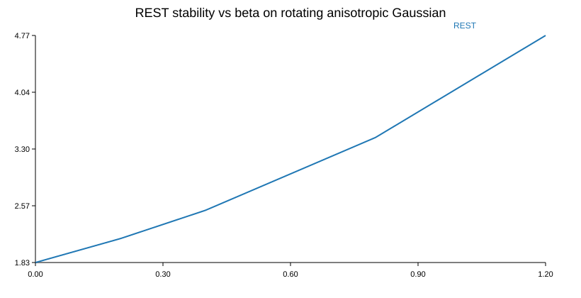

# Differential Operator Geometry

## Project overview
Differential Operator Geometry (DOG) is a research repository for retained-coordinate streaming spectral preconditioners. After the locked PIVOT, robustness sweep, adversarial search, and PRISM↔DOG stand-down, the repo is currently centered on reciprocal-only as the hard baseline and evidence-supported center of gravity.

Current REST remains important, but as a covariance-based reference implementation and comparison architecture:

> **Current REST is a covariance-based streaming geometric preconditioner in retained spectral coordinates, with partial one-step stability formalization and controlled synthetic support, but it is not validated as superior to reciprocal-only.**

The broader "geometry as the mechanism of computation" motivation remains part of the project history, but it is **not** the main claim presently supported by the repository.

In the active REST implementation, the reciprocal and exponential components act as commuting diagonal reweightings, so the repo does **not** currently claim that stage ordering is independently established as the key source of benefit.

## Purpose
This repository is currently focused on disciplined post-PIVOT claim control:
- preserve the covariance-based REST implementation as a reference implementation, not as a validated continuation claim,
- document the strongest honest contribution and its limits,
- keep reciprocal-only as the hard baseline for any future research slice,
- preserve synthetic evaluation artifacts and compact empirical lessons,
- and require benchmark evidence before any REST-like variant is promoted.

## Current stage
**Stage:** Post-PIVOT refinement / claim-control phase after Phase 5 reframing

What exists now:
- a covariance-based REST implementation under `src/rest/`,
- tests, synthetic experiments, metrics, and generated figures,
- Phase 4 empirical notes showing mixed-but-real viability under controlled drift,
- Phase 5 reframing documents that narrow the contribution to the retained-coordinate preconditioner view,
- a locked decision slice showing **PIVOT** for current REST because reciprocal-only matched or beat it,
- an archived DOG×PRISM paper/mock stress harness showing **STOP_OR_REFINE** for current REST in simulated theorem-to-contract traces,
- a reciprocal-only robustness sweep showing **RECIPROCAL_BASELINE_REMAINS_ENOUGH** under DOG-local plus archived paper/mock guardrails,
- an adversarial search showing **FAILURES_FOUND_NO_DOG_RESCUE** for current REST/whitening/no-transform,
- a 2026-04-30 stand-down note ending PRISM↔DOG as an active collaboration target,
- a reciprocal-only characterization / REST scope-demotion note,
- repo control docs (`PROJECT_STATUS.md`, `ROADMAP.md`, `WORKLOG.md`, `NEXT_ACTIONS.md`) that keep future slices honest and small.

What does not yet exist:
- a completed proof beyond draft level,
- support for a strong ordering-sensitive novelty claim in the active architecture,
- evidence that current REST is superior to reciprocal-only,
- evidence that REST helps PRISM,
- large-scale or real-world benchmark validation,
- broad operator-family generalization beyond the covariance case.

## High-level idea summary
The current repo-level summary is:

> DOG studies retained-coordinate streaming spectral preconditioners, currently centered on reciprocal-only as the hard baseline. Current REST is preserved as a covariance-based reference implementation with a modest one-step stability story, not as a validated improvement over reciprocal-only or proof of a universal geometry-first mechanism of computation.

## Repository structure

```text
Differential-Operator-Geometry/
├── README.md
├── docs/
│   ├── source-material/
│   │   ├── Abstract.txt
│   │   ├── DOG_research_notes.txt
│   │   └── chatgpt_conversation.md
│   └── project-plan/
│       ├── SOURCE_AUDIT.md
│       ├── PROJECT_SYNTHESIS.md
│       └── CRITICAL_EVALUATION.md
├── theory/
├── src/
├── tests/
└── experiments/
```

## Notes on source normalization
The original instructions referenced `Abstract.docx`, but the active source file supplied during bootstrap was converted to plain text as `abstract.txt`. The repository therefore archives the canonical source under:

- `docs/source-material/Abstract.txt`

This preserves traceability to the actual source material used during bootstrap.

## Historical Phase 4 summary
Phase 4 strengthened the empirical and diagnostic picture and led to a pre-PIVOT recommendation:

- REST remained computationally viable and empirically distinguishable from simple baselines in that phase.
- The strongest limitation was architectural: in the retained-coordinate diagonal formulation, the reciprocal and exponential maps commute, so the ordering hypothesis is not empirically distinguishable as a separate source of benefit.
- The Phase 4 recommendation was therefore **REFINE**, not scale blindly.

This is historical context. The later locked PIVOT, robustness sweep, and adversarial search supersede Phase 4 as continuation evidence: current REST is now reference/comparison material unless a new pre-registered DOG-local variant beats reciprocal-only.

Example Phase 4 artifact:



## Planned next work
The immediate next steps are post-PIVOT refinement steps, not REST continuation steps:
1. use `docs/project-plan/PRISM_DOG_STANDDOWN_2026-04-30.md` and `docs/project-plan/POST_PIVOT_REFINEMENT_PROTOCOL_2026-04-28.md` before proposing any variant,
2. keep reciprocal-only as the explicit hard baseline to beat,
3. treat `docs/project-plan/RECIPROCAL_ROBUSTNESS_SWEEP_2026-04-28.md` as the current robustness result,
4. treat `docs/project-plan/RECIPROCAL_ADVERSARIAL_FAILURE_SEARCH_2026-04-28.md` as the current adversarial result,
5. stop using PRISM as an active integration target unless explicitly reauthorized,
6. use `docs/project-plan/RECIPROCAL_ONLY_CHARACTERIZATION_AND_SCOPE_DEMOTION_2026-04-30.md` as the current positioning note,
7. test at most one narrow mechanism-specific variant at a time against DOG-local decision / robustness / adversarial harnesses,
8. update method/theorem prose only after benchmark evidence exists,
9. stop or refine whenever reciprocal-only remains enough or auditability becomes worse.

## Project control
- Status: [`PROJECT_STATUS.md`](PROJECT_STATUS.md)
- Setup: [`SETUP.md`](SETUP.md)
- Decisions: [`DECISIONS.md`](DECISIONS.md)
- Roadmap: [`ROADMAP.md`](ROADMAP.md)
- Worklog: [`WORKLOG.md`](WORKLOG.md)
- Short queue: [`docs/project-plan/NEXT_ACTIONS.md`](docs/project-plan/NEXT_ACTIONS.md)
- Positioning note: [`docs/project-plan/PRECONDITIONER_POSITIONING_NOTE.md`](docs/project-plan/PRECONDITIONER_POSITIONING_NOTE.md)
